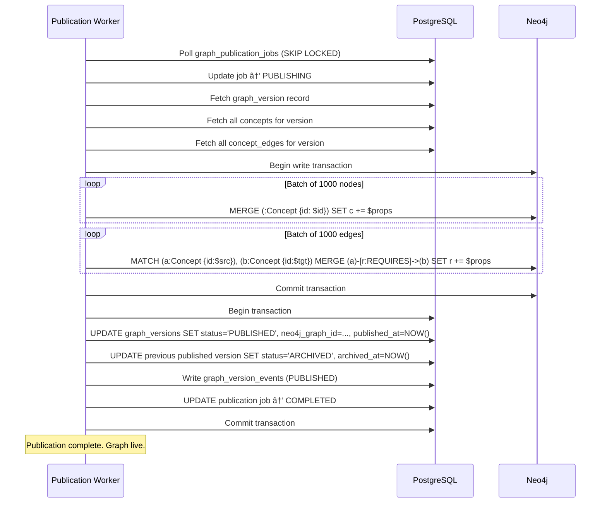

# Lexis AI — Ingestion Pipeline Architecture

**Document Type:** System Architecture  
**Status:** Draft for Engineering Review  
**Audience:** Backend Engineers, Tech Leads, Platform Team  

---

## Table of Contents

1. [Executive Summary](#1-executive-summary)
2. [Design Principles](#2-design-principles)
3. [End-to-End Ingestion Lifecycle](#3-end-to-end-ingestion-lifecycle)
4. [System Architecture](#4-system-architecture)
5. [Document Processing Pipeline](#5-document-processing-pipeline)
6. [Concept Extraction Architecture](#6-concept-extraction-architecture)
7. [Concept Canonicalization](#7-concept-canonicalization)
8. [Relationship Extraction](#8-relationship-extraction)
9. [Knowledge Graph Construction](#9-knowledge-graph-construction)
10. [Graph Validation Engine](#10-graph-validation-engine)
11. [Graph Repair Engine](#11-graph-repair-engine)
12. [Human Verification Layer](#12-human-verification-layer)
13. [Graph Versioning Strategy](#13-graph-versioning-strategy)
14. [Neo4j Architecture](#14-neo4j-architecture)
15. [Database Mapping](#15-database-mapping)
16. [Background Job Architecture](#16-background-job-architecture)
17. [Observability & Monitoring](#17-observability--monitoring)
18. [Failure Modes](#18-failure-modes)
19. [Scalability Considerations](#19-scalability-considerations)
20. [Security Considerations](#20-security-considerations)
21. [Sequence Diagrams](#21-sequence-diagrams)
22. [MVP vs Future Roadmap](#22-mvp-vs-future-roadmap)
23. [Final Architecture Assessment](#23-final-architecture-assessment)

---

## 1. Executive Summary

The Lexis AI Ingestion Pipeline transforms raw educational documents — books, PDFs, research papers, and notes — into versioned, validated knowledge graphs. These graphs are the structural foundation for every downstream feature in the platform: adaptive assessments, Socratic tutoring sessions, spaced-repetition revision plans, mastery tracking, and learning path generation.

Without the ingestion pipeline, the platform has no content. Without a high-quality pipeline, the platform has bad content — and bad content in an adaptive learning system compounds into a degraded user experience across every feature. A student presented with an incorrect prerequisite relationship will be assessed in the wrong order. A knowledge gap caused by a missed concept silently corrupts mastery tracking. The ingestion pipeline is therefore the highest-leverage system in Lexis AI.

The pipeline is designed around two hard constraints. First, the semantic complexity of transforming free-form prose into structured knowledge requires LLM reasoning at several stages — there is no reliable regex or rule-based substitute for concept extraction and relationship inference. Second, LLM outputs are probabilistic and can hallucinate, omit, or misclassify — so every LLM-produced artifact must pass through deterministic validation, a repair layer, and human verification before it can influence any user's learning experience.

The resulting architecture uses LLMs precisely where needed and deterministic software everywhere else. It is buildable by a strong engineering team, operable without ML infrastructure expertise, and extensible as the product matures.

---

## 2. Design Principles

### 2.1 Deterministic Over Probabilistic When Possible

Any stage that can be implemented with deterministic logic — file parsing, chunking, deduplication, cycle detection, schema validation — must be. LLM calls are expensive, slow, nondeterministic, and introduce surface area for error. They are used only where human-level semantic reasoning is required: concept extraction, relationship inference, and description generation. Every other stage is plain software engineering.

### 2.2 Human Verification Before Publication

No graph is published to production without explicit human approval. LLMs make mistakes. Deterministic validators catch structural errors but cannot catch semantic errors — a valid graph can still contain wrong relationships. A human reviewer is the last line of defense before a graph affects any learner. This is not optional; it is a hard invariant of the system.

### 2.3 Version Everything

Every graph is a versioned artifact. Books produce draft graphs; drafts are approved into published graphs; published graphs can be superseded by new versions without deleting the old ones. Users who are mid-session on a published graph are never silently migrated. Version history is immutable and auditable.

### 2.4 Explainability First

Every concept and every relationship in the graph carries source evidence: the specific chunk of text from the source document that caused its extraction. A reviewer can click any node or edge and see exactly what passage produced it. This is a design requirement, not a nice-to-have. It enables reviewers to make informed edits, engineers to debug extractions, and users to trace a concept back to the book that defined it.

### 2.5 Traceability to Source Content

Concepts reference chunks. Chunks reference pages and sections. Pages reference books. This chain is never broken. Every artifact produced by the pipeline carries foreign keys upward to its source. This enables partial re-ingestion, fine-grained debugging, and content licensing audits.

### 2.6 Fail Safely

Pipeline failures surface as job states with error context, never as silent partial graphs. A graph that fails validation does not advance. A graph that fails repair does not publish. Users see a clear status — processing, failed, awaiting review, published — at all times. The system never presents a corrupt or incomplete graph as valid.

### 2.7 No Premature Automation

The pipeline includes a human verification step. This step will not be removed to "speed up" ingestion without a deliberate product decision. Automation that bypasses human review trades velocity for correctness. In an educational platform where incorrect content causes real harm to learners, this tradeoff is unacceptable in the MVP and early phases.

---

## 3. End-to-End Ingestion Lifecycle

The complete lifecycle of a document through the pipeline is as follows:

```
Upload → Parsing → Segmentation → Concept Extraction →
Canonicalization → Relationship Extraction → Graph Construction →
Validation → Repair → Human Verification → Publication
```

### Stage 1: Upload

The user submits a file through the Upload Service. The service validates the file type (PDF, EPUB, DOCX, plain text), checks file size against configured limits, stores the raw file in object storage (S3 or equivalent), and creates a `book_upload` record in PostgreSQL with status `PENDING`. A `graph_build_job` record is created with status `QUEUED` and a background worker is enqueued.

### Stage 2: Parsing

The Document Processing Service retrieves the file from object storage. It dispatches to the appropriate parser based on file type: `pdfplumber` or `PyMuPDF` for PDFs, `python-docx` for DOCX, `ebooklib` for EPUB. The parser extracts raw text, preserves page numbers and layout signals, extracts document metadata (title, author, ISBN if present), and detects structural markers (chapter headings, section titles, figure captions). Output is a structured document object: a list of pages, each with raw text and metadata.

### Stage 3: Segmentation

The parsed document is split into chunks. Chunking is performed deterministically: chapters are identified by heading patterns and table-of-contents extraction where available; sections are split by second-level headings; chunks are produced by a sliding window over section text with a target length of 800–1200 tokens and 15% overlap. Each chunk is stored as a `source_chunk` in PostgreSQL with its chapter index, section title, page range, and raw text. No LLM is involved in this stage.

### Stage 4: Concept Extraction

For each chunk, an LLM prompt is submitted that asks the model to extract a list of educational concepts: named entities, defined terms, algorithms, theorems, principles, and techniques that a student would need to understand and remember. The LLM returns a structured JSON response. Each candidate concept carries the concept name, a short description, the verbatim evidence sentence from the chunk, and a confidence score estimated by the model. Candidates are stored in a staging table pending canonicalization.

### Stage 5: Canonicalization

Extracted concepts from all chunks of the document are processed through the Canonicalization Engine. This stage merges synonyms (e.g., "ML" and "Machine Learning"), collapses near-duplicates detected by fuzzy string matching and edit distance, applies consistent casing and naming conventions, and produces a deduplicated canonical concept list. The canonical concept list is stored in the `concepts` table. This stage is primarily deterministic with one optional LLM call for ambiguous merge decisions.

### Stage 6: Relationship Extraction

For each pair of concepts that co-occur in the same or adjacent chunks, the Relationship Extraction Service submits an LLM prompt asking whether a prerequisite or dependency relationship exists, in which direction, and with what confidence. Co-occurrence windowing limits the pair space to a manageable size. Relationships below a confidence threshold are discarded. Accepted relationships are stored with source evidence in a staging edges table.

### Stage 7: Graph Construction

The Graph Builder assembles the canonical concepts and validated relationships into a graph structure in memory. It assigns stable UUIDs to each node and edge, attaches metadata (book ID, version ID, confidence, evidence chunk IDs), and writes the complete graph to a `graph_versions` record with status `DRAFT`. The in-memory graph is serialized to JSON for the validation step.

### Stage 8: Validation

The Graph Validator runs a deterministic suite of validation rules against the draft graph: cycle detection, orphan node detection, root reachability, confidence threshold enforcement, duplicate edge detection, and schema compliance. Each check records a pass/fail result with a human-readable message. If critical validations fail, the job advances to Repair. If repair cannot resolve the failures, the graph is marked `FAILED` and the job halts.

### Stage 9: Repair

The Graph Repair Engine applies deterministic repair strategies to address common validation failures: removing edges below the confidence floor, merging duplicate nodes, removing orphan nodes with no relationships, and breaking cycles by removing the weakest edge in the cycle. After repair, the graph is re-validated. If it passes, it advances to Human Verification. If it fails again, the job is marked `FAILED_UNRECOVERABLE`.

### Stage 10: Human Verification

The verified graph is surfaced in the admin verification UI. A human reviewer inspects the graph visually, reviews concepts and relationships, checks source evidence for suspicious extractions, and either approves or rejects the graph. Reviewers may edit concept names and descriptions, add or remove relationships, and leave audit notes. Approval advances the graph to publication. Rejection returns the job to `FAILED_REVIEW` with reviewer notes.

### Stage 11: Publication

The Graph Publisher writes the approved graph to Neo4j. Nodes are created as `(:Concept)` nodes; edges are created as `[:REQUIRES]` and `[:RELATED_TO]` relationships. The `graph_versions` record is updated to status `PUBLISHED` and linked as the active version for the book. Previous published versions are archived. The graph becomes available to all downstream platform services.

---

## 4. System Architecture

The pipeline is composed of discrete services with explicit boundaries. All services communicate via PostgreSQL job queues and shared database state. No service calls another service directly over HTTP during background processing; this avoids distributed transaction complexity and keeps the system debuggable.

### 4.1 Upload Service

**Responsibility:** Accept file uploads from users, validate files, store to object storage, create job records.  
**Inputs:** HTTP multipart file upload, user ID, book metadata.  
**Outputs:** `book_upload` record, `graph_build_job` record, enqueued background job.  
**Dependencies:** PostgreSQL, S3-compatible object storage.  
**Boundaries:** Does not perform any document processing. Hands off to the Document Processing Service via job queue.

### 4.2 Document Processing Service

**Responsibility:** Parse uploaded files into structured page and chunk representations.  
**Inputs:** S3 path from `book_upload`, job ID.  
**Outputs:** `source_chunk` records in PostgreSQL.  
**Dependencies:** PostgreSQL, S3, PDF/DOCX/EPUB parsing libraries.  
**Boundaries:** Produces text and structure only. Does not call LLMs.

### 4.3 Concept Extraction Service

**Responsibility:** For each chunk, extract candidate educational concepts via LLM.  
**Inputs:** `source_chunk` records for a given book.  
**Outputs:** Candidate concept staging records with evidence, confidence, and chunk references.  
**Dependencies:** PostgreSQL, Anthropic/OpenAI API (or self-hosted LLM endpoint).  
**Boundaries:** Produces candidates only. Does not write to the canonical `concepts` table.

### 4.4 Canonicalization Engine

**Responsibility:** Deduplicate and normalize concept candidates into a canonical concept list.  
**Inputs:** Concept candidates for a given book.  
**Outputs:** `concepts` table records.  
**Dependencies:** PostgreSQL. Optional: LLM for ambiguous merge decisions.  
**Boundaries:** Operates on a single book's candidates. Does not cross book boundaries in the MVP.

### 4.5 Relationship Extraction Service

**Responsibility:** Infer prerequisite and dependency relationships between concepts via LLM.  
**Inputs:** Canonical `concepts` list, `source_chunks`.  
**Outputs:** Candidate relationship records with direction, type, confidence, and evidence.  
**Dependencies:** PostgreSQL, LLM API.  
**Boundaries:** Produces candidates only. Does not write to `concept_edges` directly.

### 4.6 Graph Builder

**Responsibility:** Assemble the canonical concept list and accepted relationship candidates into a versioned graph structure.  
**Inputs:** `concepts`, candidate relationships, `book_id`.  
**Outputs:** `graph_versions` record (status `DRAFT`), node/edge records.  
**Dependencies:** PostgreSQL.  
**Boundaries:** No LLM calls. Pure assembly logic.

### 4.7 Graph Validator

**Responsibility:** Run deterministic validation rules against a draft graph.  
**Inputs:** Draft `graph_versions` record and associated node/edge data.  
**Outputs:** Validation result records (pass/fail per rule), updated job status.  
**Dependencies:** PostgreSQL.  
**Boundaries:** Read-only against the graph. Does not mutate.

### 4.8 Graph Repair Engine

**Responsibility:** Apply deterministic repair strategies to address validation failures.  
**Inputs:** Validation failure report, draft graph.  
**Outputs:** Modified graph, re-validation trigger.  
**Dependencies:** PostgreSQL.  
**Boundaries:** Only applies pre-defined, safe repair operations. Never calls LLMs.

### 4.9 Graph Version Manager

**Responsibility:** Manage graph lifecycle state transitions: draft → published → archived.  
**Inputs:** Admin approval/rejection events, publication requests.  
**Outputs:** Updated `graph_versions` status, archived previous versions.  
**Dependencies:** PostgreSQL, Neo4j (for publication).  
**Boundaries:** Does not modify graph content; only manages lifecycle state.

### 4.10 Graph Publisher

**Responsibility:** Write an approved graph to Neo4j and make it live for downstream services.  
**Inputs:** Approved `graph_versions` record and all associated nodes/edges.  
**Outputs:** Neo4j nodes and relationships; updated `graph_versions.neo4j_graph_id`.  
**Dependencies:** Neo4j, PostgreSQL.  
**Boundaries:** Idempotent. Can be retried safely.

### 4.11 Verification Service (Admin UI Backend)

**Responsibility:** Serve the graph verification UI, handle reviewer edits, record approval/rejection.  
**Inputs:** HTTP requests from admin UI, reviewer actions.  
**Outputs:** Updated concept records, relationship records, approval events.  
**Dependencies:** PostgreSQL.  
**Boundaries:** Only operates on graphs in `PENDING_REVIEW` state.

### 4.12 Neo4j Integration Layer

**Responsibility:** Provide a typed query interface between application services and Neo4j.  
**Inputs:** Application-level graph queries and mutations.  
**Outputs:** Cypher query results.  
**Dependencies:** Neo4j.  
**Boundaries:** All Neo4j access goes through this layer. Raw Cypher is never embedded in business logic outside this layer.

---

## 5. Document Processing Pipeline

### 5.1 File Ingestion

Files are retrieved from S3 using the object key stored in `book_uploads.storage_path`. The service streams the file into a temporary working directory for parsing. File type is determined by MIME type and extension cross-validation, not filename alone.

Supported formats in MVP:
- PDF (primary format)
- DOCX (Microsoft Word)
- EPUB (e-books)
- Plain text (.txt, .md)

### 5.2 Metadata Extraction

For PDFs, metadata is extracted from the PDF info dictionary: title, author, subject, creation date. For DOCX, the core properties XML is parsed. For EPUB, the OPF metadata block is used. When metadata is unavailable or sparse, fields are left null and can be supplemented by the user at upload time via the UI.

### 5.3 Chapter and Section Detection

Chapter detection uses a priority-ordered strategy:

1. **Table of Contents extraction** — if the PDF has a bookmark tree or EPUB has an NCX/NAV document, use it directly. This is the highest-confidence signal.
2. **Heading style detection** — for DOCX files, heading styles (Heading 1, Heading 2) are structural markers. Use them directly.
3. **Font-size and weight heuristics** — for PDFs without bookmarks, text blocks with significantly larger font sizes or bold formatting at the start of a page are candidates for chapter/section headings.
4. **Regex patterns** — as a fallback, patterns like `Chapter N`, `CHAPTER N`, `Section N.M`, and Roman numerals at line starts are used.

Detected chapters and sections are stored as metadata on `source_chunks`. The detection strategy used is recorded for debugging.

### 5.4 Chunking Strategy

Chunks are produced per section, not per page. Page-based chunking breaks mid-sentence and destroys semantic coherence. Section-based chunking preserves topic boundaries.

**Chunk parameters:**
- Target size: 800–1200 tokens (approximately 600–900 words)
- Overlap: 15% of chunk size (carried from end of previous chunk)
- Minimum chunk size: 200 tokens (shorter sections are merged with the next)
- Maximum chunk size: 1500 tokens (longer sections are split at sentence boundaries)

**Why these parameters:** 800–1200 tokens fits within a single LLM context with room for the prompt and response. Overlap prevents concepts that straddle chunk boundaries from being missed. Section alignment means the chapter and section metadata on each chunk is accurate.

**Tradeoff:** Overlap creates duplicated text. Concept extraction may produce near-duplicate candidates across overlapping chunks. This is resolved by the Canonicalization stage, which is why both chunking overlap and canonicalization are required together.

### 5.5 Content Normalization

Before chunking, raw text undergoes normalization:
- Strip headers, footers, and page numbers (detected by repetition across pages)
- Remove figure captions and table content (tagged separately, not chunked for concept extraction)
- Normalize Unicode (NFKC normalization)
- Collapse multiple whitespace characters
- Remove hyphenation artifacts from PDF line breaks

Normalization is applied deterministically with a fixed set of rules. Edge cases that cannot be normalized cleanly are flagged in the `source_chunks` record for human review.

---

## 6. Concept Extraction Architecture

### 6.1 Concept Candidate Generation

For each `source_chunk`, a single LLM prompt is submitted. The prompt instructs the model to act as an educational content analyst and extract educational concepts from the chunk.

**Prompt design constraints:**
- The system prompt specifies the output schema precisely.
- Temperature is set to 0 (or the lowest available setting) for maximum determinism.
- The prompt explicitly instructs the model to extract only concepts that a student would need to understand and recall — not every noun, not every proper name.
- The model is told to exclude: author names, publisher names, geographic references unless they are the subject of study, and formatting artifacts.

**Output schema (JSON array):**
```json
[
  {
    "name": "Gradient Descent",
    "description": "An iterative optimization algorithm that adjusts parameters in the direction of steepest loss reduction.",
    "evidence": "Gradient descent works by computing the gradient of the loss function with respect to the model parameters and taking a step in the negative gradient direction.",
    "confidence": 0.92,
    "difficulty_hint": "intermediate"
  }
]
```

### 6.2 Concept Filtering

After LLM extraction, candidates are filtered deterministically:

- Concepts with fewer than 2 characters are dropped.
- Concepts with confidence below 0.5 are dropped.
- Concepts whose names are pure numbers, punctuation, or common stop words are dropped.
- Concepts whose descriptions are empty or shorter than 20 characters are dropped.

This filtering runs before canonicalization, reducing the merge workload.

### 6.3 Concept Scoring

Each concept carries a confidence score from the LLM (0.0–1.0). This score is normalized and carried through to the canonical concept record. After canonicalization, if multiple candidates are merged into one canonical concept, the final confidence is the maximum confidence among merged candidates (not an average — if any source was high-confidence, the concept is high-confidence).

### 6.4 Concept Metadata

Each canonical concept record in PostgreSQL stores:

| Field | Type | Description |
|---|---|---|
| `id` | UUID | Stable concept identifier |
| `book_id` | UUID | Parent book |
| `graph_version_id` | UUID | Graph version this concept belongs to |
| `name` | TEXT | Canonical name |
| `description` | TEXT | Generated description |
| `difficulty` | ENUM | `introductory`, `intermediate`, `advanced` |
| `confidence` | FLOAT | Extraction confidence (0.0–1.0) |
| `chapter_index` | INT | Source chapter (from primary evidence chunk) |
| `source_chunk_ids` | UUID[] | All chunks that contributed evidence |
| `primary_evidence` | TEXT | Verbatim evidence sentence |
| `created_at` | TIMESTAMP | |
| `updated_at` | TIMESTAMP | |

---

## 7. Concept Canonicalization

### 7.1 Why Canonicalization is Required

Concept extraction runs per chunk. The same concept will appear in multiple chunks under different surface forms. "SGD", "Stochastic Gradient Descent", "stochastic gradient descent", and "stochastic GD" are all the same concept. Without canonicalization, the graph contains quadruplicated nodes, inflated edge counts, and incorrect prerequisite structures. Canonicalization converts the noisy multi-chunk output into a clean single-book concept vocabulary.

### 7.2 Synonym and Acronym Resolution

**Step 1: Acronym expansion.** A dictionary of domain-common acronyms (e.g., ML, DL, NLP, SGD, ReLU) is applied to expand acronyms in concept names. This dictionary is built once per domain and extended as new books reveal new acronyms. Candidates that match a known acronym are merged with their expanded form.

**Step 2: Lowercase normalization for comparison.** All concept names are lowercased for comparison purposes only. The canonical name retains original casing from the highest-confidence candidate.

**Step 3: Fuzzy string matching.** Candidates with an edit distance below a threshold (Levenshtein distance ≤ 2 for short strings, ≤ 4 for longer strings) are grouped as merge candidates. The RapidFuzz library is used for efficient pair-wise comparison.

**Step 4: Token overlap matching.** Concepts sharing more than 80% token overlap (after stop-word removal) are also grouped as merge candidates.

### 7.3 Duplicate Merging

Merge groups are resolved as follows:
- The candidate with the highest confidence score becomes the canonical form.
- All `source_chunk_ids` from merged candidates are combined.
- The `primary_evidence` is taken from the highest-confidence candidate.

If two candidates have similar confidence and meaningfully different descriptions, this is flagged as a `MERGE_CONFLICT` requiring human reviewer attention. The system does not auto-merge ambiguous conflicts.

### 7.4 Naming Consistency

After merging:
- Concept names are title-cased unless the canonical form is a known acronym (all caps) or a specific proper noun.
- Names longer than 60 characters are flagged for reviewer shortening.

### 7.5 Optional LLM Assist

For `MERGE_CONFLICT` cases, an optional LLM call can be made: submit both candidates with their descriptions and evidence, and ask the model whether they represent the same concept. This is logged with full input/output for auditability. It is triggered only on conflicts, not on the full candidate list.

---

## 8. Relationship Extraction

### 8.1 Scope of Relationships

The MVP supports two relationship types:

- **REQUIRES** — Concept A requires prior understanding of Concept B. This is a directed prerequisite edge.
- **RELATED_TO** — Concepts A and B are related or frequently co-occur but no strict prerequisite exists. This is an undirected informational edge.

`REQUIRES` edges form the learning path structure. `RELATED_TO` edges support recommendations and concept browsing. Additional relationship types (PART_OF, CONTRASTS_WITH, EXTENDS) are reserved for Phase 2.

### 8.2 Pair Generation

Not all concept pairs can be submitted for relationship extraction — for a book with 200 concepts, that is 19,900 pairs, and submitting each pair as an LLM call is prohibitively expensive. Pairs are scoped as follows:

1. **Co-occurrence windowing** — Only pairs of concepts that appear in the same chunk or in adjacent chunks (window size = 2) are candidates. This covers the majority of real prerequisites, which are established in close textual proximity.
2. **Chapter co-occurrence** — For concepts in the same chapter that do not appear in adjacent chunks, a lighter-weight LLM pass checks whether a relationship exists.
3. **Cross-chapter pairs are not checked in the MVP.** Cross-chapter prerequisites are inferred transitively from within-chapter chains.

### 8.3 LLM Relationship Prompt

For each candidate pair, the prompt includes:
- Both concept names and descriptions
- The chunk(s) in which they co-occur
- The question: does Concept A require Concept B, does Concept B require Concept A, are they related without a prerequisite, or is there no meaningful relationship?
- Instructions to return a structured JSON object.

**Output schema:**
```json
{
  "relationship": "REQUIRES",
  "direction": "A_REQUIRES_B",
  "confidence": 0.85,
  "evidence": "The backpropagation algorithm requires a prior understanding of the chain rule of calculus."
}
```

### 8.4 Confidence Scoring and Thresholds

- Relationships below confidence 0.6 are discarded.
- Relationships between 0.6 and 0.75 are accepted as `LOW_CONFIDENCE` and flagged for reviewer attention.
- Relationships above 0.75 are accepted without special flagging.

### 8.5 Relationship Record Structure

| Field | Type | Description |
|---|---|---|
| `id` | UUID | |
| `graph_version_id` | UUID | |
| `source_concept_id` | UUID | Source of the relationship (the prerequisite) |
| `target_concept_id` | UUID | Target (the concept that requires the source) |
| `relationship_type` | ENUM | `REQUIRES`, `RELATED_TO` |
| `confidence` | FLOAT | |
| `evidence` | TEXT | Verbatim evidence sentence |
| `source_chunk_id` | UUID | Chunk that provided evidence |
| `is_low_confidence` | BOOL | Flagged for reviewer |
| `created_at` | TIMESTAMP | |

---

## 9. Knowledge Graph Construction

### 9.1 Graph Assembly

The Graph Builder operates after canonicalization and relationship extraction are complete. It:

1. Loads all canonical concepts for the book from the `concepts` staging table.
2. Loads all accepted relationship candidates.
3. Assigns stable UUID node IDs (these are the `concepts.id` values).
4. Assigns stable UUID edge IDs.
5. Assembles an in-memory graph as an adjacency structure.
6. Attaches all metadata to each node and edge.
7. Writes the graph to a `graph_versions` record with status `DRAFT`.

### 9.2 Node Structure

Each node in the graph represents a canonical concept:

```json
{
  "id": "uuid",
  "book_id": "uuid",
  "graph_version_id": "uuid",
  "name": "Backpropagation",
  "description": "...",
  "difficulty": "intermediate",
  "confidence": 0.91,
  "chapter_index": 4,
  "source_chunk_ids": ["uuid1", "uuid2"],
  "primary_evidence": "..."
}
```

### 9.3 Edge Structure

Each edge represents a relationship between two concepts:

```json
{
  "id": "uuid",
  "graph_version_id": "uuid",
  "source_id": "uuid",
  "target_id": "uuid",
  "type": "REQUIRES",
  "confidence": 0.87,
  "evidence": "...",
  "source_chunk_id": "uuid",
  "is_low_confidence": false
}
```

### 9.4 Graph Metadata

The `graph_versions` record carries:
- `book_id` — parent book
- `version_number` — monotonically increasing integer per book
- `status` — `DRAFT | VALIDATING | PENDING_REVIEW | APPROVED | PUBLISHED | ARCHIVED | FAILED`
- `node_count` — concept count (cached for quick display)
- `edge_count` — relationship count (cached)
- `build_job_id` — the job that produced this version
- `neo4j_graph_id` — set after publication
- `published_at` — set after publication
- `archived_at` — set when superseded
- `book_id` — parent book
- `version_number` — monotonically increasing integer per book
- `status` — `DRAFT | VALIDATING | PENDING_REVIEW | APPROVED | PUBLISHED | ARCHIVED | FAILED`
- `node_count` — concept count (cached for quick display)
- `edge_count` — relationship count (cached)
- `build_job_id` — the job that produced this version
- `neo4j_graph_id` — set after publication
- `published_at` — set after publication
- `archived_at` — set when superseded

### 9.5 Stable IDs Across Versions

Concept IDs are stable within a book's history. When a new version is built, the Canonicalization Engine attempts to match canonical concepts to concepts in the previous version by name. Matched concepts retain their `id`. New concepts receive new UUIDs. Retired concepts from prior versions are not deleted; they are soft-deleted by being absent from the new `graph_version_id`.

---

## 10. Graph Validation Engine

The validator runs a fixed suite of deterministic checks. Each check is independent. Results are stored per check, per graph version. The following table defines each validation rule.

### 10.1 Validation Rules

**V01 — No Cycles in REQUIRES Graph**
- Purpose: The prerequisite graph must be a DAG. Cycles mean "A requires B requires A", which is semantically invalid and causes infinite loops in learning path generation.
- Implementation: Depth-first search with color marking (white/gray/black). Any back edge indicates a cycle.
- Failure behavior: CRITICAL. Graph advances to Repair. If repair cannot break cycles, graph fails.

**V02 — No Orphan Nodes**
- Purpose: Concepts with no relationships cannot be placed in a learning path or assessment.
- Implementation: Nodes with degree 0 in the union of REQUIRES and RELATED_TO edges.
- Failure behavior: WARNING. Orphan nodes are flagged but do not block graph advancement. Reviewer decides whether to add relationships or remove the node.

**V03 — Valid Root Nodes**
- Purpose: Every learning path must have entry points — concepts with no prerequisites. At least one such concept must exist.
- Implementation: Nodes with in-degree 0 in the REQUIRES graph.
- Failure behavior: CRITICAL if count = 0. If all concepts require something, the DAG has no starting point.

**V04 — No Duplicate Edges**
- Purpose: Multiple REQUIRES edges between the same ordered pair waste storage and confuse path generation.
- Implementation: Check for duplicate (source_id, target_id, type) tuples.
- Failure behavior: WARNING. Duplicates are automatically deduplicated in Repair.

**V05 — Confidence Floor**
- Purpose: Concepts or relationships that are too low-confidence should not be published.
- Implementation: Any node with confidence < 0.4 or any edge with confidence < 0.5 fails this check.
- Failure behavior: WARNING. Low-confidence artifacts are flagged for reviewer. Repair can remove them.

**V06 — Reachability from Roots**
- Purpose: Every concept in the graph should be reachable from at least one root concept via REQUIRES edges.
- Implementation: BFS from all root nodes. Unreachable nodes are isolated subgraphs.
- Failure behavior: WARNING. Isolated subgraphs are flagged for reviewer. They may represent a valid disconnected topic or an extraction error.

**V07 — Minimum Graph Size**
- Purpose: A graph with fewer than 5 concepts is likely a parsing or extraction failure.
- Implementation: `node_count < 5`.
- Failure behavior: CRITICAL. Likely indicates a pipeline failure upstream.

**V08 — Schema Compliance**
- Purpose: Ensure all node and edge records have required fields and valid enum values.
- Implementation: JSON schema validation against defined schemas.
- Failure behavior: CRITICAL. Schema failures indicate a bug in the Graph Builder.

### 10.2 Validation Result Storage

```sql
CREATE TABLE graph_validation_results (
  id UUID PRIMARY KEY,
  graph_version_id UUID REFERENCES graph_versions(id),
  rule_code TEXT,           -- e.g., 'V01'
  passed BOOLEAN,
  severity TEXT,            -- 'CRITICAL' | 'WARNING'
  detail JSONB,             -- rule-specific failure detail
  created_at TIMESTAMP
);
```

---

## 11. Graph Repair Engine

The Repair Engine applies safe, deterministic transformations to a graph that has failed validation. It is not a recovery system for all failures — some failures require human judgment and are not repaired automatically.

### 11.1 Repair Operations

**R01 — Break Cycles (addresses V01)**
Strategy: For each cycle detected by V01, remove the edge with the lowest confidence score in the cycle. If multiple edges are tied, remove the one with the longest path alternative. This is a greedy heuristic, not guaranteed optimal, but sufficient for typical small cycles produced by noisy LLM extraction. Each removed edge is logged with the reason.

**R02 — Remove Duplicate Edges (addresses V04)**
Strategy: For each group of duplicate (source, target, type) edges, retain the one with the highest confidence. All others are marked `deleted` with reason `DEDUPLICATION`.

**R03 — Remove Subthreshold Nodes and Edges (addresses V05)**
Strategy: Remove nodes with confidence < 0.4 and their incident edges. Remove edges with confidence < 0.5. Log each removal.

**R04 — Remove Pure Orphans (optional, addresses V02)**
Strategy: After R01, R02, R03, any remaining nodes with degree 0 are removed. This is applied only if the orphan count is below 20% of total nodes; above that threshold, the high orphan count indicates an extraction failure and the graph is failed rather than aggressively pruned.

### 11.2 Repair Safety Constraints

- Repair never adds nodes or edges. It only removes.
- Repair never changes concept names or descriptions.
- Every removal is recorded in a `graph_repair_log` table with the operation, the artifact ID, and the reason.
- After repair, the validator is re-run in full. If critical failures remain, the graph is marked `FAILED_UNRECOVERABLE` and repair stops.

### 11.3 Limitations

Repair cannot fix:
- A graph with no root nodes after cycle breaking (the structure is genuinely invalid)
- A graph with fewer than 5 concepts after pruning (the extraction failed)
- Semantic errors (wrong relationships that pass structural validation)

---

## 12. Human Verification Layer

### 12.1 Why Humans Remain in the Loop

LLMs produce plausible-sounding errors. A relationship between "Calculus" and "Machine Learning" might be extracted with high confidence even if the book never establishes that relationship — the LLM is drawing on training knowledge, not source evidence. A human reviewer who reads the source evidence can catch this. Deterministic validators catch structural problems; humans catch semantic problems. This combination is necessary for educational content quality.

### 12.2 Verification UI Capabilities

The verification interface presents:
- A graph visualization (force-directed layout) with nodes colored by difficulty and edges labeled by type.
- A side panel showing the selected node or edge's full metadata, including source evidence text.
- Inline editing of concept names and descriptions.
- Ability to delete nodes (with cascade to incident edges).
- Ability to delete individual edges.
- Ability to add relationships between existing concepts.
- A filter to show only low-confidence flagged items.
- A summary of all validation results for the graph.

### 12.3 Approval Flow

Reviewer clicks "Approve". The Verification Service writes an `APPROVED` event to `graph_version_events` with the reviewer's user ID and timestamp. The Graph Version Manager transitions the graph to `APPROVED` status and enqueues a publication job.

### 12.4 Rejection Flow

Reviewer clicks "Reject" with a required text note. The graph status is set to `FAILED_REVIEW`. The `graph_build_job` is marked `REJECTED` with the reviewer note. The uploader (book owner) is notified. The graph can be re-ingested from scratch by creating a new upload; it cannot be retried from the failed state (the failure may be fundamental to the source document).

### 12.5 Auditability

Every reviewer action is recorded:
- Who approved or rejected and when.
- Every edit: what was changed, from what value, to what value, by whom.
- Final graph state at time of approval is snapshotted.

The audit log is immutable. It is stored in a `graph_audit_events` table and is never overwritten.

---

## 13. Graph Versioning Strategy

### 13.1 Version States

```
DRAFT → VALIDATING → PENDING_REVIEW → APPROVED → PUBLISHED
                   ↓                             ↓
               FAILED                        ARCHIVED
```

Every state transition is recorded in `graph_version_events` with timestamp, actor (system or user ID), and optional notes.

### 13.2 Draft Graph

A draft graph is produced by the Graph Builder after successful construction. It exists only in PostgreSQL. It is not visible to end users. It can be inspected by admins for debugging.

### 13.3 Published Graph

A published graph has been approved by a human reviewer and written to Neo4j. It is the active graph for a book. Downstream services (assessment, learning session, tutor) read from Neo4j.

### 13.4 Archived Graph

When a new graph version is published for a book, the previous published version transitions to `ARCHIVED`. It remains in both PostgreSQL and Neo4j but is no longer the active version. Users who are mid-session on the archived version continue to use it until their session completes (session-version pinning).

### 13.5 Rollback

If a newly published graph is found to be erroneous after publication, an admin can trigger a rollback:
1. The current `PUBLISHED` graph is transitioned to `ARCHIVED`.
2. The previous `ARCHIVED` graph is transitioned back to `PUBLISHED`.
3. The Neo4j active version pointer for the book is updated.
4. Active user sessions that have already loaded the bad version are not automatically corrected; they will pick up the rollback on next session start.

Rollback is a manual admin action, not automated.

### 13.6 Graph Evolution

Books can be re-uploaded with updated content. Each upload creates a new `book_upload` and a new ingestion pipeline run, producing a new `graph_version`. Old versions are not deleted.

### 13.7 User Safety

Users are always served the graph version that was `PUBLISHED` at the time their learning session started. Their session carries a `graph_version_id` foreign key. If the published version changes during their session, they are not silently migrated. They receive a notification that a new version is available and can choose to restart with the new version.

---

## 14. Neo4j Architecture

### 14.1 What Lives in Neo4j vs PostgreSQL

**Neo4j:** The live, published knowledge graph. Concept nodes, prerequisite edges, related-to edges. Queried at runtime by downstream services for learning paths, assessments, and recommendations. Neo4j is the read layer for the published graph.

**PostgreSQL:** Everything else. Book records, upload records, chunks, concept candidates, build jobs, graph versions, validation results, repair logs, audit events, draft graph data, all pipeline state. PostgreSQL is the system of record.

The rule: if it needs a graph traversal query at runtime, it's in Neo4j. If it's operational metadata, it's in PostgreSQL.

### 14.2 Node Labels

- `:Concept` — all concept nodes
- `:Book` — one node per book (for book-scoped queries without cross-joining)

### 14.3 Relationship Types

- `[:REQUIRES]` — directed prerequisite edge (source → target means target requires source)
- `[:RELATED_TO]` — undirected informational edge

### 14.4 Node Properties

```cypher
(:Concept {
  id: "uuid",
  book_id: "uuid",
  graph_version_id: "uuid",
  name: "Backpropagation",
  description: "...",
  difficulty: "intermediate",
  confidence: 0.91,
  chapter_index: 4
})
```

### 14.5 Relationship Properties

```cypher
[:REQUIRES {
  id: "uuid",
  confidence: 0.87,
  evidence: "...",
  is_low_confidence: false
}]
```

### 14.6 Indexes

```cypher
CREATE INDEX concept_id FOR (c:Concept) ON (c.id);
CREATE INDEX concept_book_version FOR (c:Concept) ON (c.book_id, c.graph_version_id);
CREATE INDEX concept_name FOR (c:Concept) ON (c.name);
```

### 14.7 Constraints

```cypher
CREATE CONSTRAINT concept_id_unique FOR (c:Concept) REQUIRE c.id IS UNIQUE;
```

### 14.8 Graph Publication Flow

Publication is a two-phase operation:

**Phase 1: Write to Neo4j.**
Open a Neo4j write transaction. Create all concept nodes. Create all relationships. Commit. If the transaction fails, the graph remains in `APPROVED` status and publication is retried.

**Phase 2: Update PostgreSQL.**
Update `graph_versions.status` to `PUBLISHED`. Set `neo4j_graph_id`. Archive the previous version. This PostgreSQL update is the authoritative commit. If this fails after Neo4j succeeds, the publication job retries and the `MERGE` Cypher clause makes the Neo4j write idempotent.

### 14.9 Query Patterns

Learning path generation:
```cypher
MATCH path = (start:Concept {id: $start_id})-[:REQUIRES*]->(end:Concept)
WHERE start.book_id = $book_id AND start.graph_version_id = $version_id
RETURN nodes(path)
```

Prerequisites for a concept:
```cypher
MATCH (prereq:Concept)-[:REQUIRES]->(target:Concept {id: $concept_id})
RETURN prereq
```

Related concepts:
```cypher
MATCH (c:Concept {id: $concept_id})-[:RELATED_TO]-(related:Concept)
RETURN related LIMIT 10
```

---

## 15. Database Mapping

### 15.1 PostgreSQL Schema

**`books`**
```sql
id UUID PRIMARY KEY
user_id UUID REFERENCES users(id)
title TEXT
author TEXT
isbn TEXT
subject_domain TEXT
status TEXT  -- 'UPLOADING' | 'PROCESSING' | 'READY' | 'FAILED'
created_at TIMESTAMP
updated_at TIMESTAMP
```

**`book_uploads`**
```sql
id UUID PRIMARY KEY
book_id UUID REFERENCES books(id)
user_id UUID REFERENCES users(id)
original_filename TEXT
storage_path TEXT          -- S3 key
file_size_bytes BIGINT
mime_type TEXT
upload_status TEXT         -- 'PENDING' | 'STORED' | 'FAILED'
created_at TIMESTAMP
```

**`source_chunks`**
```sql
id UUID PRIMARY KEY
book_id UUID REFERENCES books(id)
book_upload_id UUID REFERENCES book_uploads(id)
chunk_index INT
chapter_index INT
chapter_title TEXT
section_title TEXT
page_start INT
page_end INT
token_count INT
raw_text TEXT
created_at TIMESTAMP
```

**`graph_build_jobs`**
```sql
id UUID PRIMARY KEY
book_id UUID REFERENCES books(id)
book_upload_id UUID REFERENCES book_uploads(id)
graph_version_id UUID REFERENCES graph_versions(id)
status TEXT  -- 'QUEUED' | 'PARSING' | 'EXTRACTING' | 'CANONICALIZING' | 
             --  'BUILDING' | 'VALIDATING' | 'REPAIRING' | 'PENDING_REVIEW' |
             --  'APPROVED' | 'PUBLISHING' | 'PUBLISHED' | 'FAILED' |
             --  'FAILED_UNRECOVERABLE' | 'REJECTED'
error_message TEXT
retry_count INT DEFAULT 0
last_heartbeat_at TIMESTAMP
created_at TIMESTAMP
updated_at TIMESTAMP
```

**`graph_versions`**
```sql
id UUID PRIMARY KEY
book_id UUID REFERENCES books(id)
build_job_id UUID REFERENCES graph_build_jobs(id)
version_number INT
status TEXT  -- 'DRAFT' | 'VALIDATING' | 'PENDING_REVIEW' | 'APPROVED' |
             --  'PUBLISHED' | 'ARCHIVED' | 'FAILED'
node_count INT
edge_count INT
neo4j_graph_id TEXT
published_at TIMESTAMP
archived_at TIMESTAMP
created_at TIMESTAMP
updated_at TIMESTAMP
```

**`concepts`**
```sql
id UUID PRIMARY KEY
book_id UUID REFERENCES books(id)
graph_version_id UUID REFERENCES graph_versions(id)
name TEXT
description TEXT
difficulty TEXT  -- 'introductory' | 'intermediate' | 'advanced'
confidence FLOAT
chapter_index INT
primary_evidence TEXT
source_chunk_ids UUID[]
is_deleted BOOLEAN DEFAULT FALSE  -- soft delete for repair operations
created_at TIMESTAMP
updated_at TIMESTAMP
```

**`concept_edges`**
```sql
id UUID PRIMARY KEY
graph_version_id UUID REFERENCES graph_versions(id)
source_concept_id UUID REFERENCES concepts(id)
target_concept_id UUID REFERENCES concepts(id)
relationship_type TEXT  -- 'REQUIRES' | 'RELATED_TO'
confidence FLOAT
evidence TEXT
source_chunk_id UUID REFERENCES source_chunks(id)
is_low_confidence BOOLEAN DEFAULT FALSE
is_deleted BOOLEAN DEFAULT FALSE
created_at TIMESTAMP
```

**`graph_validation_results`** — defined in Section 10.2.

**`graph_repair_log`**
```sql
id UUID PRIMARY KEY
graph_version_id UUID REFERENCES graph_versions(id)
operation TEXT         -- 'REMOVE_EDGE' | 'REMOVE_NODE' | 'DEDUP_EDGE'
artifact_id UUID
reason TEXT
before_value JSONB
created_at TIMESTAMP
```

**`graph_version_events`**
```sql
id UUID PRIMARY KEY
graph_version_id UUID REFERENCES graph_versions(id)
event_type TEXT   -- 'STATUS_CHANGE' | 'APPROVED' | 'REJECTED' | 'PUBLISHED' | 'ARCHIVED' | 'ROLLBACK'
actor_id UUID     -- user ID or NULL for system events
notes TEXT
metadata JSONB
created_at TIMESTAMP
```

**`graph_audit_events`**
```sql
id UUID PRIMARY KEY
graph_version_id UUID REFERENCES graph_versions(id)
actor_id UUID REFERENCES users(id)
action TEXT    -- 'EDIT_CONCEPT' | 'DELETE_CONCEPT' | 'DELETE_EDGE' | 'ADD_EDGE' | etc.
entity_type TEXT
entity_id UUID
before_value JSONB
after_value JSONB
created_at TIMESTAMP
```

---

## 16. Background Job Architecture

### 16.1 Job Queue

The ingestion pipeline uses PostgreSQL as its job queue via a SKIP LOCKED pattern. This avoids adding a separate queue dependency (Redis, RabbitMQ) in the MVP and is adequate for the expected ingestion volume (tens to hundreds of books, not millions).

```sql
SELECT * FROM graph_build_jobs
WHERE status = 'QUEUED'
ORDER BY created_at ASC
FOR UPDATE SKIP LOCKED
LIMIT 1;
```

Workers poll this query on a configurable interval. A single worker processes a single job at a time. Multiple workers can run concurrently without coordination overhead.

### 16.2 Job Stages and Status Machine

Each stage of the pipeline updates `graph_build_jobs.status` upon entry and completion. If a stage fails, it sets `status = 'FAILED'` with `error_message`. The `last_heartbeat_at` field is updated every 30 seconds during long-running stages (chunking, LLM extraction). A watchdog process marks jobs as `FAILED` if `last_heartbeat_at` is older than 5 minutes, indicating a dead worker.

### 16.3 Retry Logic

Transient failures (LLM API timeout, S3 connectivity) are retried with exponential backoff, up to `max_retries = 3`. Each retry increments `retry_count`. After 3 retries, the job is marked `FAILED`.

Retries are safe because each stage is written to be idempotent:
- Chunk creation uses `INSERT ... ON CONFLICT DO NOTHING` keyed on `(book_upload_id, chunk_index)`.
- Concept candidate insertion is idempotent by chunk ID.
- Graph Builder truncates and rewrites graph nodes for the version before rebuilding.
- Neo4j publication uses `MERGE` instead of `CREATE`.

### 16.4 Publication Jobs

Publication is a separate job type from build jobs. After a graph is approved, a `graph_publication_jobs` record is created and enqueued. Publication workers handle only publication; they do not re-run extraction or validation.

### 16.5 Concurrency

One ingestion job per book at a time. A book with an in-progress job cannot accept a new upload. This constraint is enforced by checking for active jobs in the Upload Service before creating a new `book_upload`.

Multiple books can be ingested concurrently by running multiple workers.

---

## 17. Observability & Monitoring

### 17.1 Structured Logging

All services emit JSON-structured logs with a consistent schema:

```json
{
  "timestamp": "ISO8601",
  "level": "INFO | WARN | ERROR",
  "service": "concept-extraction-service",
  "job_id": "uuid",
  "book_id": "uuid",
  "event": "concept_extraction_complete",
  "metadata": { "chunk_id": "uuid", "candidates_count": 12, "llm_latency_ms": 1420 }
}
```

Every LLM call is logged with: prompt token count, completion token count, latency, model used, and whether the response passed JSON schema validation.

### 17.2 Metrics

Key metrics exposed via a `/metrics` endpoint (Prometheus-compatible):

- `ingestion_jobs_total{status}` — count of jobs by final status
- `ingestion_stage_duration_seconds{stage}` — histogram of stage duration
- `llm_api_calls_total{service, status}` — LLM call volume
- `llm_api_latency_seconds{service}` — LLM call latency histogram
- `concepts_extracted_per_chunk` — concept yield per chunk
- `validation_failures_total{rule}` — count of failures per validation rule
- `graph_repair_operations_total{operation}` — repair operation counts
- `neo4j_write_duration_seconds` — publication write time

### 17.3 Distributed Tracing

Each ingestion job carries a `trace_id` (= `build_job_id`). This ID is passed in all log events, LLM API calls, and database operations for the job. This allows reconstructing the complete execution trace of any job from logs alone, without a tracing infrastructure dependency in the MVP.

In Phase 2, OpenTelemetry instrumentation can be added to export traces to Jaeger or similar.

### 17.4 Job Monitoring Dashboard

An admin dashboard page shows:
- Active jobs with current stage and elapsed time
- Recently completed jobs with final status
- Failed jobs with error messages
- Average ingestion time per stage over the last 7 days
- LLM API error rate and cost per job

### 17.5 Failure Alerts

Alerts fire when:
- Any job is in `FAILED` state — immediate notification to platform oncall
- Job heartbeat is stale (worker likely dead) — immediate notification
- LLM API error rate exceeds 10% in a 5-minute window
- Neo4j write failure (publication job fails)

### 17.6 Audit Trails

All `graph_audit_events` are append-only. Reviewer actions, approval events, and rollback events are all audited. Audit records are retained indefinitely and are the compliance record for graph quality.

---

## 18. Failure Modes

### 18.1 Corrupt or Unparseable PDF

**Detection:** The parser throws an exception. `graph_build_job.status` is set to `FAILED` with a parse error message.  
**Recovery:** No automated recovery. The user is notified. They can re-upload a fixed file or a different format.  
**User experience:** Upload status shows "Processing Failed — unable to parse the document. Please try a different file format."

### 18.2 LLM API Unavailability

**Detection:** HTTP 5xx or timeout from LLM provider. Job status shows `FAILED` after max retries.  
**Recovery:** Automatic retry with exponential backoff (3 retries over ~8 minutes). If all retries fail, job fails and admin is alerted.  
**User experience:** Upload status shows "Processing delayed — we will retry automatically. No action required."

### 18.3 LLM Returns Malformed JSON

**Detection:** JSON schema validation of LLM response fails.  
**Recovery:** Retry the same chunk with a temperature=0 re-prompt. If it fails twice, the chunk is skipped and its concepts are not extracted. The chunk ID is recorded in the job metadata as `skipped_chunks`.  
**User experience:** Transparent; the final graph may have slightly fewer concepts from that section.

### 18.4 Validation Failure (Critical)

**Detection:** V01, V03, V07, or V08 fail after Repair.  
**Recovery:** Graph is marked `FAILED_UNRECOVERABLE`. No automatic recovery.  
**User experience:** Upload status shows "Ingestion Failed — the document produced an invalid knowledge graph. Please contact support."

### 18.5 Neo4j Write Failure (Publication)

**Detection:** Neo4j write transaction throws an exception.  
**Recovery:** Publication job retries up to 3 times. If all fail, graph remains `APPROVED` in PostgreSQL. Admin is alerted. Manual re-trigger of publication is possible.  
**User experience:** Admin sees "Publication Pending". End users see the previous published version.

### 18.6 Partial Extraction Success

**Detection:** A significant percentage of chunks (>30%) were skipped due to LLM failures.  
**Recovery:** The Concept Extraction Service records skip count. If skips exceed the threshold, the graph is flagged `LOW_COVERAGE` in validation (V09 — a warning, not critical).  
**User experience:** Reviewer sees a warning: "Coverage may be incomplete — over 30% of document sections were not fully processed."

### 18.7 Worker Process Crash

**Detection:** Watchdog detects stale `last_heartbeat_at` (> 5 minutes) and marks job `FAILED`.  
**Recovery:** A new worker can re-pick the job. Because each stage is idempotent, the job resumes safely from the start of the failed stage (not from mid-stage).  
**User experience:** Invisible if recovery is fast. If the job fails after max retries, user sees failure notification.

---

## 19. Scalability Considerations

### 19.1 Large Books

Very large books (>500 pages, >300 concepts) produce more chunks, more LLM calls, and larger graphs. Practical mitigations:

- LLM calls per chunk are independent and can be parallelized. The Concept Extraction Service can run concurrent chunk extractions (configurable parallelism, default 4).
- Relationship extraction pair space is bounded by co-occurrence windowing; it does not grow quadratically for large books.
- Neo4j writes for large graphs are batched (1000 nodes/edges per transaction).

Books exceeding a configured size limit (e.g., 1000 pages) are rejected at upload time with a message asking the user to split the document.

### 19.2 Many Concurrent Users

Ingestion is a background process. It does not block user-facing request paths. Worker pool size is configurable. At low scale (MVP), 2–4 workers are sufficient. Workers are stateless and can be scaled horizontally.

### 19.3 Many Graph Versions

PostgreSQL can hold thousands of graph versions without performance degradation with proper indexing. Neo4j will accumulate archived graphs; archived graph nodes carry their `graph_version_id` for isolation. A periodic archival job can move very old Neo4j archived graphs to cold storage in Phase 3.

### 19.4 LLM Cost Management

LLM calls are the primary cost driver. Per-book cost is bounded by chunk count × (extraction prompt tokens + relationship prompt tokens). For a typical 200-page book with ~150 chunks and ~100 concept pairs, estimated cost is $0.50–$2.00 per book at current API pricing. Cost is logged per job for tracking.

### 19.5 Neo4j Scaling

Neo4j Community Edition supports the MVP. For production at scale, Neo4j Enterprise or AuraDB (managed) is preferred for clustering, read replicas, and managed backups. The query patterns in this architecture are all read-heavy; a single read replica serves downstream platform services while writes go to the primary.

---

## 20. Security Considerations

### 20.1 File Validation

Files are validated before storage:
- MIME type is checked against allowed types (PDF, DOCX, EPUB, TXT).
- File size is bounded (configurable, default 50MB).
- Files are not executed or rendered server-side during validation; only headers are read.
- After storage, files are scanned by an antivirus/malware scanner (ClamAV or cloud equivalent) before parsing begins.

### 20.2 Upload Security

- Pre-signed S3 URLs are used for client-side uploads; the backend never proxies large file bytes.
- S3 bucket is not publicly accessible. All access is via signed URLs with expiry.
- Object keys include the user's UUID to prevent path traversal.

### 20.3 Malicious Documents

PDF and DOCX files can contain embedded scripts, macros, or external references. Mitigations:
- Parsing libraries (pdfplumber, python-docx) extract text only; they do not execute embedded scripts.
- External URL references in documents are not fetched.
- Parsing workers run in isolated containers with no outbound network access to limit blast radius from parser vulnerabilities.

### 20.4 Authorization

- Users can only access builds and graphs for books they own.
- Admin verification UI is restricted to users with the `REVIEWER` role.
- All API endpoints enforce JWT authentication and resource ownership checks.
- Graph version data (nodes, edges, evidence text) is never served to end users until the graph is `PUBLISHED`.

### 20.5 Version Protection

- Published graphs cannot be mutated directly. Changes require creating a new version.
- Archived and published graph records are soft-deleted only; no hard deletes.
- Rollback requires the `ADMIN` role.

### 20.6 Audit Logging

All admin and reviewer actions are recorded in `graph_audit_events` and `graph_version_events`. These logs are append-only, not modifiable through any application path. Log records include the actor's user ID and IP for accountability.

---

## 21. Sequence Diagrams

### 21.1 Upload to Published Graph (Happy Path)

```mermaid
sequenceDiagram
    participant U as User
    participant API as Upload Service
    participant S3 as Object Storage
    participant W as Worker
    participant LLM as LLM API
    participant PG as PostgreSQL
    participant N4J as Neo4j

    U->>API: POST /books/upload (file)
    API->>S3: Store file
    API->>PG: Create book_upload, graph_build_job (QUEUED)
    API->>U: 202 Accepted { job_id }

    W->>PG: Poll for QUEUED job (SKIP LOCKED)
    W->>PG: Update job status → PARSING
    W->>S3: Fetch file
    W->>W: Parse & chunk document
    W->>PG: Write source_chunks
    W->>PG: Update job status → EXTRACTING

    loop For each chunk
        W->>LLM: Extract concepts prompt
        LLM->>W: JSON concept candidates
        W->>PG: Write concept candidates
    end

    W->>PG: Update job status → CANONICALIZING
    W->>W: Deduplicate & merge concepts
    W->>PG: Write canonical concepts

    W->>PG: Update job status → EXTRACTING (relationships)
    loop For each concept pair
        W->>LLM: Relationship extraction prompt
        LLM->>W: JSON relationship
        W->>PG: Write concept_edges
    end

    W->>PG: Update job status → BUILDING
    W->>W: Assemble graph
    W->>PG: Write graph_versions (DRAFT), concepts, edges

    W->>PG: Update job status → VALIDATING
    W->>W: Run validation rules
    W->>PG: Write graph_validation_results (all pass)

    W->>PG: Update graph_version status → PENDING_REVIEW
    W->>PG: Update job status → PENDING_REVIEW

    Note over U,N4J: Human reviewer inspects graph

    U->>API: POST /graphs/{version_id}/approve
    API->>PG: Write graph_version_events (APPROVED)
    API->>PG: Update graph_version status → APPROVED
    API->>PG: Enqueue publication job

    W->>PG: Poll for publication job
    W->>PG: Fetch approved graph (concepts + edges)
    W->>N4J: MERGE concept nodes and relationships
    W->>PG: Update graph_version → PUBLISHED, set neo4j_graph_id
    W->>PG: Archive previous published version
```



### 21.2 Upload to Validation Failure

```mermaid
sequenceDiagram
    participant U as User
    participant API as Upload Service
    participant W as Worker
    participant PG as PostgreSQL

    U->>API: POST /books/upload (file)
    API->>PG: Create book_upload, graph_build_job (QUEUED)
    API->>U: 202 Accepted

    W->>PG: Claim job, begin processing
    Note over W: Parsing, Extraction, Canonicalization complete

    W->>PG: Update job → VALIDATING
    W->>W: Run validation rules
    Note over W: V01 fails (cycle detected), V07 fails (3 concepts only)
    W->>PG: Write validation failures

    W->>PG: Update job → REPAIRING
    W->>W: R01: Break cycle (remove 1 edge)
    W->>W: Re-run validation
    Note over W: V01 passes, V07 still fails (2 concepts after repair)

    W->>PG: Update graph_version → FAILED
    W->>PG: Update job → FAILED_UNRECOVERABLE, write error_message

    Note over U: User notified via email / status poll
    U->>API: GET /books/{book_id}/status
    API->>U: { status: "FAILED", message: "..." }
```



### 21.3 Graph Verification Workflow

```mermaid
sequenceDiagram
    participant R as Reviewer
    participant UI as Verification UI
    participant VS as Verification Service
    participant PG as PostgreSQL

    R->>UI: Open pending review queue
    UI->>VS: GET /graphs/pending-review
    VS->>PG: SELECT graph_versions WHERE status='PENDING_REVIEW'
    PG->>VS: Graph list
    VS->>UI: Graph summaries
    R->>UI: Open graph for review

    UI->>VS: GET /graphs/{version_id}/full
    VS->>PG: Fetch concepts, edges, validation results
    PG->>VS: Full graph data
    VS->>UI: Render graph visualization

    R->>UI: Click concept "Gradient Descent"
    UI->>R: Show metadata + evidence text

    R->>UI: Edit description of "Gradient Descent"
    UI->>VS: PATCH /concepts/{id}
    VS->>PG: Update concept, write graph_audit_events
    PG->>VS: OK

    R->>UI: Delete edge (A → B) — low confidence
    UI->>VS: DELETE /edges/{id}
    VS->>PG: Soft-delete edge, write graph_audit_events
    PG->>VS: OK

    R->>UI: Click "Approve"
    UI->>VS: POST /graphs/{version_id}/approve
    VS->>PG: Write graph_version_events (APPROVED)
    VS->>PG: Update graph_version status → APPROVED
    VS->>PG: Enqueue publication job
    VS->>UI: 200 OK
    UI->>R: "Graph approved. Publication queued."
```



### 21.4 Graph Publication Workflow



---

## 22. MVP vs Future Roadmap

### 22.1 MVP (Phase 1)

The MVP delivers the complete pipeline for a single document format (PDF primary, DOCX secondary). It covers:

- Upload Service with S3 storage
- PDF and DOCX parsing
- Text-based chunking (section-aware)
- LLM-based concept extraction (single prompt per chunk)
- Deterministic canonicalization (fuzzy matching)
- LLM-based relationship extraction (co-occurrence windowed)
- Graph assembly with stable IDs
- Full validation suite (V01–V08)
- Deterministic repair (R01–R04)
- Human verification UI with edit, approve, reject
- Draft/Published/Archived version states
- Neo4j publication with REQUIRES and RELATED_TO
- Full PostgreSQL schema as defined
- Background job processing with PostgreSQL queue
- Structured logging and basic metrics
- Admin dashboard for job monitoring

**Not in MVP:** EPUB parsing, cross-book concept graphs, automatic approval, advanced relationship types, multi-language support, user-facing graph exploration.

### 22.2 Phase 2

- EPUB and plain text ingestion
- Cross-book concept linking (shared concepts across books in a domain)
- Additional relationship types: PART_OF, CONTRASTS_WITH, EXTENDS
- Concept difficulty auto-calibration based on assessment performance data
- Incremental re-ingestion (detect changed sections and re-extract only affected chunks)
- Confidence calibration through human feedback loop (reviewer corrections improve extraction prompts)
- OpenTelemetry distributed tracing
- Concept embedding generation for semantic similarity search (justified at this stage by cross-book linking requirements)

### 22.3 Phase 3

- Automated quality checks to reduce reviewer burden on high-quality extractions (reviewer focuses on flagged items only)
- Multi-language document support
- Domain-specific extraction prompt tuning based on subject area
- Graph merging: combine graphs from multiple books on the same topic into a unified domain graph
- Cold archival of old Neo4j graph versions
- User-facing graph exploration UI (browse concepts, view prerequisites, trace evidence)
- API for external publishers to submit content for ingestion

---

## 23. Final Architecture Assessment

### Complexity

The pipeline has meaningful complexity — eleven distinct stages, two storage systems, LLM integration, background job processing, and a human verification layer. This complexity is load-bearing. Each stage exists because removing it produces a demonstrably worse outcome: removing chunking breaks LLM context limits; removing canonicalization produces duplicate graph nodes; removing validation publishes structurally corrupt graphs; removing human verification publishes semantically corrupt graphs. No stage is speculative.

The complexity is also well-distributed. No single service carries disproportionate responsibility. The stages are sequential and independently testable. A strong engineering team can build and test each stage in isolation.

### Implementation Risk

**Medium.** The primary risk is LLM extraction quality. If the LLM produces low-quality concepts or relationships for certain document types or domains, the downstream graph will be weak. This risk is mitigated by the human verification layer, which catches semantic errors before publication, and by the repair engine, which removes clearly low-confidence artifacts. The system degrades gracefully — bad LLM output produces a graph that fails validation or requires more reviewer intervention, not a silently corrupt published graph.

PDF parsing quality is the second risk. Academic PDFs with complex layouts, multi-column text, and mathematical notation are harder to parse cleanly. This is mitigated by starting with well-structured educational books and expanding format support as parser quality improves.

### Operational Risk

**Low.** The system uses familiar components: PostgreSQL, S3, Neo4j, and a standard LLM API. There are no experimental infrastructure dependencies. The PostgreSQL-based job queue avoids Redis or RabbitMQ operational overhead in the MVP. Failure modes are well-defined and surfaced clearly in job status and logs.

### Scalability

Sufficient for the product's early life. The architecture can handle hundreds of books per day without modification. For thousands of books per day, worker pool scaling and an optional move to a dedicated queue (Bull, Celery) would be appropriate but are not required at launch.

### Maintainability

High. Each stage is a discrete service with explicit inputs and outputs. The database schema provides full traceability from published graph back to source text. Validation rules are enumerated and independently auditable. New validation rules can be added without touching other stages. New relationship types can be added by extending the extraction prompt and the Neo4j schema without schema migrations on existing nodes.

### Why This Architecture

The alternatives considered and rejected:

**Multi-agent architecture:** An agent swarm that autonomously plans and coordinates extraction introduces unpredictable execution paths, difficult debugging, and high failure surface area. The pipeline stages defined here produce the same outcome with deterministic, debuggable control flow.

**Embedding-heavy architecture:** Using embeddings for concept extraction, similarity, and relationship detection was considered. Embeddings are powerful but opaque — it is difficult to explain why two concepts were linked without source evidence. They are also slower to build tooling around and require vector infrastructure. For Phase 2 cross-book linking, embeddings become justified. In Phase 1, deterministic matching and LLM reasoning are sufficient and more explainable.

**Fully automated approval:** Removing human review reduces time to published graph but removes the only semantic error check in the system. LLM errors on educational content cause measurable learning harm. The human review step exists for a product reason, not an engineering one.

The recommended architecture is a straightforward, reliable pipeline that uses LLMs precisely and deterministic engineering broadly. It is implementable, operable, and correct. It will serve the product well from MVP through early growth, with clear extension points for the features that follow.

---

*End of Document*